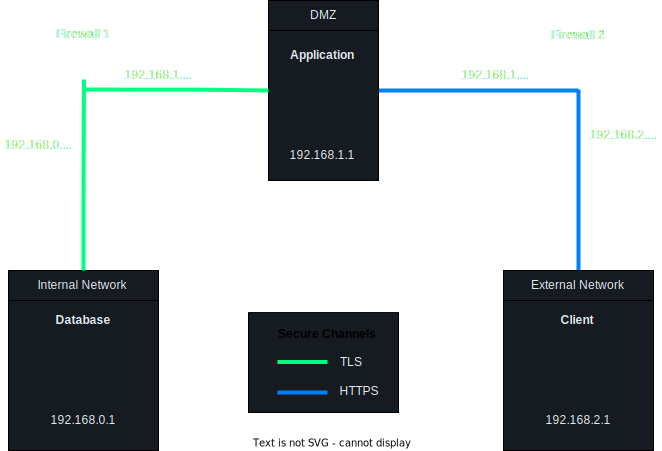

# T52 GrooveGalaxy Project Read Me

## Team

| Number | Name              | User                               | E-mail                                    |
| -------|-------------------|------------------------------------|-------------------------------------------|
| 99053  | André Torres      | <https://github.com/atorrres>      | <mailto:andre.torres@tecnico.ulisboa.pt>  |
| 99074  | Gonçalo Nunes     | <https://github.com/goncaloinunes> | <mailto:goncaloinunes@tecnico.ulisboa.pt> |
| 99115  | Pedro Lobo        | <https://github.com/pedroclobo>    | <mailto:pedro.lobo@tecnico.ulisboa.pt>    |

  

## Contents

This repository contains documentation and source code for the *Network and Computer Security (SIRS)* project.

The [REPORT](REPORT.md) document provides a detailed overview of the key technical decisions and various components of the implemented project.
It offers insights into the rationale behind these choices, the project's architecture, and the impact of these decisions on the overall functionality and performance of the system.

This document presents installation and demonstration instructions.

## Installation

To see the project in action, it is necessary to set up a virtual environment, with 3 networks and 5 machines.

The following diagram shows the networks and machines:



The following table shows the network topology configuration:

|   # Interface   |      IP       | Adapter |
|:---------------:|:-------------:| :-----: |
|  **Database**   |               |
|        1        |  192.168.0.1  |  eth0   |
| **Firewall 1**  |
|        1        | 192.168.0.254 |  eth0   |
|        2        | 192.168.1.254 |  eth1   |
| **Application** |
|        1        |  192.168.1.1  |  eth0   |
| **Firewall 2**  |
|        1        | 192.168.1.253 |  eth0   |
|        2        | 192.168.2.254 |  eth1   |
|   **Client**    |
|        1        |  192.168.2.1  |  eth0   |

### Prerequisites

All virtual machines are based on: Linux 64-bit, Kali 2023.3

[Download](https://cdimage.kali.org/kali-2023.3/kali-linux-2023.3-installer-amd64.iso) and [install](https://www.kali.org/docs/virtualization/install-virtualbox-guest-vm/) a virtual machine of Kali Linux 2023.3.

### Machine configurations

#### Base Machine

The base machine will be used as a base for the other machines.

Begin by attaching a **Bridged Adapter** to **Adapter 1**.

Boot up the machine and update the `apt` mirrors:

```sh
$ sudo apt update
```

Use `git` to obtain a copy of the `T52 GrooveGalaxy Project`. Notice that you have to set up a personal access token in order to clone the repository.

```sh
$ git clone https://github.com/tecnico-sec/t52-andre-pedro-goncalo.git
```

Our repository has the necessary scripts to set up each machine. Notice that **the setup of the application, database and client machines has to be done in parallel**, as these entities have to exchange certificates to set up TLS/HTTPS.

Link clone this VM as needed to create new machines. Don't forget to select the option **Generate new MAC addresses for all network adapters**, under **MAC Address Policy**.

#### Database Server

**The setup of the client machine has to be done in parallel with the setup of the database and application machines.** Please refer to the [application](#application-server) and [client](#client) configuration sections.

This machine runs the database server (PostgreSQL 16.1).

##### First Configuration Step
Boot up the machine.

If you cloned this machine from the Base VM, the system already has the project repository.

Start by running the installation script at the root of the project repository:

```sh
# Run the installation script
$ cd database
$ chmod +x setup.sh
$ sudo ./setup.sh
```

Refer to the [Database, Application and Client Machines](#database-application-and-client-machines) section for the rest of the configuration.

##### Second Step Configuration

Shutdown the machine.

Before booting up the virtual machine again, replace the current **Adapter 1** with an **Internal Network** named `sw-1`.

Boot up the virtual machine and verify that the configuration was successful by checking the following:

Running `hostnamectl | grep 'hostname'` should reveal the hostname `database`.

Running `ip a` should reveal IP `192.168.0.1` under the `eth0` interface.

Running `sudo nmap localhost` should reveal the following open ports:

```
PORT     STATE SERVICE
5432/tcp open  postgresql
```

The following lines should be present in the file `/etc/postgresql/16/main/postgresql.conf`:

```
listen_addresses = '*'
port = 5432
ssl = on
ssl_cert_file = '/etc/ssl/certs/database.crt'
ssl_key_file = '/etc/ssl/private/database.key'
```

A line similar to the following should be present in the file `/etc/postgresql/16/main/pg_hba.conf`:

```
hostssl groove postgres 192.168.0.0/24 md5
```

#### Application Server

**The setup of the application server has to be done in parallel with the setup of the database and client machines.** Please refer to the [database](#database-server) and [client](#client) configuration sections.

This machine runs the application server (Java 17 / Spring-Boot 2.4.1).

##### First Configuration Step

Give this machine at least 2GB of RAM and boot it up.

If you cloned this machine from the base machine, the cloned repository is under the `t52-andre-pedro-goncalo` folder.

Start by running the installation script at the root of the project repository:

```sh
# Run the installation script
$ cd application
$ chmod +x setup.sh
$ sudo ./setup.sh
```

Refer to the [Database, Application and Client Machines](#database-application-and-client-machines) section for the rest of the configuration.

##### Second Step Configuration

After concluding the parallel configuration, the maven dependencies need to be downloaded and installed.

Run the following commands in the root of the project repository:

```sh
# Download and install maven dependencies
$ cd crypto
$ mvn install
$ cd ../application
$ mvn clean spring-boot:run
```

The expected output should include the output from the `apt` package manager and the output from `mvn` downloading the required dependencies. The output should terminate with a **BUILD FAILURE** message, as the backend can't yet connect to the PostgreSQL database server.

Shutdown the machine.

Before booting up the virtual machine again, replace the current **Adapter 1** with an **Internal Network** named `sw-1`.

Boot up the virtual machine and verify that the configuration was successful by checking the following:

Running `hostnamectl | grep 'hostname'` should reveal the hostname `application`.

Running `ip a` should reveal IP `192.168.0.2` under the `eth0` interface.

To start the application, run the following command in the `application` folder of the cloned repository:

```sh
mvn clean spring-boot:run
```

#### Client

**The setup of the client machine has to be done in parallel with the setup of the database and application machines.** Please refer to the [application](#application-server) and [client](#client) configuration sections.

This machine acts as a client by interacting with the application with a terminal user interface.

##### First Step Configuration
Boot up the machine.

If you cloned this machine from the Base VM, the system already has the project repository.

Start by running the installation script at the root of the project repository:

```sh
# Run the installation script
$ cd client
$ chmod +x setup.sh
$ sudo ./setup.sh
```

Refer to the [Database, Application and Client Machines](#database-application-and-client-machines) section for the rest of the configuration.

##### Second Step Configuration

Run the following commands in the root of the project repository:

```sh
$ cd crypto
$ mvn install
$ cd ../client
$ mvn compile exec:java -Dexec.mainClass="pt.tecnico.Client"
```

The expected output should include the output from the `apt` package manager and the output from `mvn` downloading the required dependencies. You should then be greeted with the client's TUI prompt.

Shutdown the machine.

Before booting up the virtual machine again, replace the current **Adapter 1** with an **Internal Network** named `sw-3`.

Boot up the virtual machine and verify that the configuration was successful by checking the following:

Running `hostnamectl | grep 'hostname'` should reveal the hostname `client`.

Running `ip a` should reveal IP `192.168.2.1` under the `eth0` interface.

#### Database, Application and Client Machines

The setup of the database, application and client machines has to be done in parallel, as these entities have to exchange certificates to set up TLS/HTTPS.

Only refer to this section **after having completed the first configuration step** of the [database](#database-server), [application](#application-server) and [client](#client) machines.

The application and client machines will prompt you for two passwords each. One for the private key and the other for the keystore. Pick each one of the passwords, entering them followed by the Enter key.

For the application to sign the database and client certificates, those need to be copied from the respective machines to the application machine. Each one of the three machines should prompt you to do this. The `ssh` service has been enabled on the application machine for you to copy the certificates.

Enter the following commands, replacing `<user>` and `<IP>` by the username and IP of the application machine, respectively. You can get the IP of the application machine by running `ip a`.

```sh
# Enter this command in the database machine (in the root of the cloned repository)
$ cd database
$ scp database.csr <user>@<IP>:~/t52-andre-pedro-goncalo/application

# Enter this command in the client machine (in the root of the cloned repository)
$ cd client
$ scp client.csr <user>@<IP>:~/t52-andre-pedro-goncalo/application
```

After successfully executing this commands, press any key to proceed with the installation in all the three machines.

After the application machine has signed the database and client certificates, these need to be copied back to the respective machines, along with the application certificate.

Enter the following commands, in the application machine, replacing `<user>`, `<IP-DATABASE>` and `<IP-CLIENT>` by the username, IP of the database machine and IP of the client machine, respectively.

```sh
# Enter this command in the application machine (in the root of the cloned repository)
$ cd application
$ scp application.crt database.crt <user>@<IP-DATABASE>:~/t52-andre-pedro-goncalo/database
$ scp application.crt client.crt <user>@<IP-CLIENT>:~/t52-andre-pedro-goncalo/client
```

After successfully executing the commands, press any key to proceed with the installation in all the three machines.

After the application machine has added the client certificate to its trusted keystore, the keystore needs to be copied to the client machine.

Enter the following command, in the application machine, replacing `<user>`, `<IP-CLIENT>` by the username and IP of the client machine, respectively.

```sh
# Enter this command in the application machine (in the root of the cloned respository)
$ cd application
$ scp application.p12 <user>@<IP-CLIENT>:~/t52-andre-pedro-goncalo/client
```

After successfully executing the commands, press any key to proceed with the installation in the application and client machines.

Continue now with the **Second Step Installation** on the [database](#database-server), [application](#application-server) and [client](#client) machines.

#### Firewall 1

This machine acts as a firewall between the internal network and the DMZ, using `iptables` to manage the firewall rules.

Boot up the machine.

If you cloned this machine from the Base VM, the system already has the project repository.

Run the following commands in the root of the project repository:

```sh
$ cd firewall-1
$ chmod +x setup.sh
$ sudo ./setup.sh
$ shutdown now
```

The script should have no output and exit code 0.

Before booting up the machine, replace the current **Adapter 1** with an **Internal Network** named `sw-1`.

Add a new **Adapter 2** with an **Internal Network** named `sw-2`.

Boot up the virtual machine and verify that the configuration was successful by checking the following:

Running `hostnamectl | grep 'hostname'` should reveal the hostname `firewall-1`.

Running `ip a` should reveal IP `192.168.0.254` and IP `192.168.1.254` under the `eth0` and `eth1` interfaces, respectively.

#### Firewall 2

This machine acts as a firewall between the DMZ and the external network, using `iptables` to manage the firewall rules.

Boot up the machine.

If you cloned this machine from the Base VM, the system already has the project repository.

Run the following commands in the root of the project repository:

```sh
$ cd firewall-2
$ chmod +x setup.sh
$ sudo ./setup.sh
$ shutdown now
```

The script should have no output and exit code 0.

Before booting up the machine, replace the current **Adapter 1** with an **Internal Network** named `sw-2`.

Add a new **Adapter 2** with an **Internal Network** named `sw-3`.

Boot up the virtual machine and verify that the configuration was successful by checking the following:

Running `hostnamectl | grep 'hostname'` should reveal the hostname `firewall-2`.

Running `ip a` should reveal IP `192.168.1.253` and IP `192.168.2.254` under the `eth0` and `eth1` interfaces, respectively.

## Demonstration

Now that all the networks and machines are up and running, ...

*(give a tour of the best features of the application; add screenshots when relevant)*

```sh
$ demo command
```

*(replace with actual commands)*

*(IMPORTANT: show evidence of the security mechanisms in action; show message payloads, print relevant messages, perform simulated attacks to show the defenses in action, etc.)*

This concludes the demonstration.

## Additional Information

### Links to Used Tools and Libraries

- [Java 17.0.8](https://openjdk.java.net/)
- [Maven 3.8.7](https://maven.apache.org/)
- [PostgreSQL 16.1](https://www.postgresql.org/)
- [Spring Boot 2.4.1](https://spring.io/projects/spring-boot)

### Versioning

We use [SemVer](http://semver.org/) for versioning.

### License

This project is licensed under the MIT License - see the [LICENSE.txt](LICENSE.txt) for details.

----
END OF README
