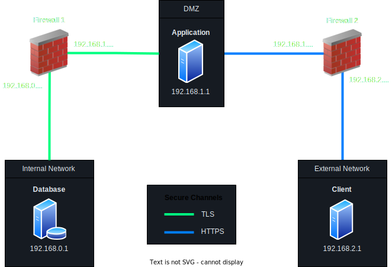

# T52 GrooveGalaxy Project Report

## 1. Introduction

This project implements a secure business solution for the GrooveGalaxy retail.

GrooveGalaxy is an online music store that sells songs in a custom format. It allows users to search and browse through a wide range of songs, artists and genres. It offers choices in file formats like WAV or FLAC, suitable for various devices. GrooveGalaxy also offers a personal account feature, enabling users to manage their purchases and preferences, combining convenience, variety, and personalization.

This project is divided in three main components: **secure documents**, **infrastructure** and **security challenge**.

The secure documents component protects the core business's documents, that lacks protection, with the use of a custom cryptographic library. The solution provides confidentiality, as only the song's owner can access its content. It also provides authenticity of the song data, by ensuring integrity and freshness. The implemented solution is detailed in the [Secure Document Format section](#21-secure-document-format).

The infrastructure component includes the installation and configuration of servers to support the business scenario. This includes the setup of 3 networks, with 5 machines. This includes an internal network (which contains a database server), a DMZ (which contains an application server) and an external network (which contains a client). A firewall monitors and filters traffic between the internal and DMZ networks as does another firewall between the DMZ and external network. The secure the communication between the core machines, an extra layer of protection is added in the form of secure channels. TLS and HTTPS are used between the internal network and DMZ and between the DMZ and external network, respectively. The infrastructure implementation is detailed in the [Infrastructure section] (#22-infrastructure).

The security challenge component introduces new requirements, impacting the already developed solution. There is now the need to use a cryptographic solution to quickly start in the middle of an audio stream, without compromising security. The concept of family was also added, where individuals can be members of each family, and a protected song should be accessible to all members. The implemented solution required modifying the custom cryptographic library and devising a dynamic key distribution mechanism. The implemented solution to the security challenge is detailed in the [Security Challenge section](#23-security-challenge).

## 2. Project Development

### 2.1. Secure Document Format

#### 2.1.1. Design

The custom cryptographic library addresses GrooveGalaxy's business requirements of authenticating the song data, and ensuring the confidentiality of the song's content. The library was implemented under the assumption that the user and service share a secret symmetric key.

##### 2.1.1.1 Integrity

To achieve integrity, an HMAC-SHA256 is computed over the song data and metadata (which includes the freshness token), using the shared secret key. The Base64 encoded HMAC is included in the JSON object as the value of the `MIC` key.

Freshness is also added to the document to prevent replay attacks. When protecting the document, the current timestamp is added to the JSON object as the value of the `timestamp` key. The timestamp is checked when checking and unprotecting the file. If the timestamp is older than 30 seconds, the document is rejected.

The integrity and freshness given to the document, guarantee the song data authenticity.

The HMAC-SHA256 algorithm was chosen as it guarantees integrity while not using ciphers, which yields a better performance compared to other solutions that use ciphers, like a message integrity code. The hash is computed using the secret shared key, making the hash calculation impossible without the key. The SHA256 algorithm was chosen as it is a widely used hash function, and it is considered secure.

A timestamp was used to guarantee freshness, as the sender and receiver's clock will be loosely synchronized and, unlike a nonce or a counter, it does not require any additional state to be stored.

##### 2.1.1.2 Confidentiality

To ensure confidentiality, the song data is ciphered using the secret shared key. The chosen cipher is AES with the CTR block cipher mode and no padding. The initialization vector is randomly generated and included in the JSON object as the value of the `initialization-vector` key. A new initialization vector is generated for each document. The Base64 encoded ciphered song data is then included in the JSON object as the value of the `mediaContent` key.

The AES algorithm was chosen as it a robust symmetric encryption protocol. The CTR mode was chosen as, unlike ECB, doesn't leave patterns of the plaintext in the ciphertext, as long as the initialization vector is not reused across documents. It also the advantage of providing resynchronization which, unlike with CBC, allows for random access, suitable for scenarios where playback needs to start in the middle of a stream. As it is a stream cipher, padding is not required, providing a better performance in this regard compared to other block ciphers.

##### 2.1.1.3 Protected Document Format

An example of a protected file is shown below:

```json
{
  "data": {
    "media": {
      "mediaInfo": {
        "owner": "Bob",
        "format": "WAV",
        "artist": "Alison Chains",
        "title": "Man in the Bin",
        "genre": [
          "Grunge",
          "Alternative Metal"
        ]
      },
      "mediaContent": "jfexBdtaVPxdClBayBofE+Cw79m29xq4c4h2iDcChQ6OZaTnvaKSf3iM/OKUb/RbXKIs1x7VpsAcaR6kfxSKYNXm6i0+J5Q+J7XOzcAs1576390s+rpSogLZtKSYdIoQwr+aefQU6lGaEXyLjWeVhUow6dmQRBJicEaUZpOXRvtMmM6dpX49QI8lekJvXyTGndsLIDgQ5SngT9Wq6IHdZ8Tvo3BrvuqQHuyc/AAQpa6HjIhyuh09C2kJt9SKtAU2peNHJ8J8kV2NXAhU13M8LeT5HDvvhooQWffRah3abeS08S72cmMiLDo3wlxzM32DpTOaMuVVHuaQriEnk02bWFiJ4zvxVAi6yfbtImfj7b4Njaxe8ND+tXgrWrdASREQJAn0gl2aj1+EN31+ITwUlmUbaq6tyCjD/Annchdtbhv8HsGxMWjZMZceZx4MDYF/8LNPYuGv8ImlYnrxX2VJtJlZRsStTpJ0MQHSA9/id5lSHDiMwJBTjMzzNxQofL4YomBg17TDKQnuQAJ7Bmz2xTKV+WYh40btdwmU7fbkCMg2bDOJTpGzk7Dv"
    }
  },
  "metadata": {
    "cipher": {
      "algorithm": "AES",
      "block-mode": "CTR",
      "padding": "NoPadding",
      "initialization-vector": "slRLVrSnWODt2SomtwsJqA\u003d\u003d"
    },
    "mic": {
      "algorithm": "HmacSHA256",
      "timestamp": 1702224124362
    }
  },
  "MIC": "/B/X501hRSatMg6ZhahN3SBdBRpTp8/OU1KDoM/zT6w\u003d"
}
```

#### 2.1.2. Implementation

The chosen language to implement the custom cryptographic library is Java. The used cryptographic library is the Java Cryptography API.

(_Detail the implementation process, including the programming language and cryptographic libraries used._)

(_Include challenges faced and how they were overcome._)

### 2.2. Infrastructure

#### 2.2.1. Network and Machine Setup

The built infrastructure consists of a set of main machines, in three distinct networks, and two firewall machines.

The main machines include a database machine, an application machine, which runs the application, and a client machine that interacts with the application through a command-line interface.



##### 2.2.1.1 Internal Network

The internal network is composed of machines that are not meant to be exposed to the external network. For simplicity reasons, the internal network consists of one core machine, the database machine, which runs PostgreSQL 16.1. PostgreSQL was used as it is a powerful open-source relational database management system. It is also a familiar DBMS, used in previous courses.

To shield the internal network from outside traffic, a firewall is used to filter incoming and outgoing packets. The `iptables` utility was used to configure the firewall rules as it is the de-facto standard for managing packet filter rules of the Linux kernel firewall. The configured rules enforce the following policy:

- All TCP traffic from the internal network at port 5432 to the DMZ is allowed.
- All TCP traffic from the DMZ to the internal network, to port 5432, is allowed.
- All other traffic, including IPv6, is blocked.

The database server also has configured firewall rules. This offers an extra layer of protection as if the firewall gets compromised and its rules disabled, the database server is not immediately exposed. The configured rules enforce the following policy:

- Don't start any new connections.
- Only accept traffic from already established TCP connections with the DMZ, destined to the database's server 5432 port.
- All other traffic, including IPv6, is blocked.

##### 2.2.1.2 DMZ

The demilitarized zone is meant to be composed of servers that need to communicate with the internal network, but also need to communicate with the external network.
A demilitarized zone was used as it acts as a buffer zone providing an additional layer of security. If one of these servers is compromised, the servers of the internal network are not immediately vulnerable, as there is a firewall between the two networks. If only an internal and external networks were configured and the application server was instead placed in the internal network, configuration would be simpler, but compromising one of the internal network's machines would make it easier to compromise the database server.

The DMZ consists of one core machine, the application machine. It runs Spring Boot 2.4.1. This technology was picked as it is a popular Java framework to build web applications. It has a simple configuration and enables a rapid development process. It is also a familiar technology, used in previous courses. With it, a backend was built along with a REST API, allowing external clients to communicate with it.

The application exposes the following endpoints:

To shield the DMZ from malicious outside traffic, a firewall is used to filter incoming and outgoing packets. The `iptables` utility was used to configure the firewall rules as it is the de-facto standard for managing packet filter rules of the Linux kernel firewall. The configured rules enforce the following policy:

- All TCP traffic from the DMZ on port 8443 to the external network is allowed.
- All TCP traffic from the external network to the DMZ on port 8443 is allowed.
- All other traffic, including IPv6, is blocked.

The application server also has configured firewall rules. This offers an extra layer of protection as if the firewall gets compromised and its rules disabled, the application server is not so vulnerable to malicious traffic originated from the external network. The configured rules enforce the following policy:

- Accept TCP traffic originated or destined to the internal network, from or to the internal network's machine port 5432.
- Don't start new connection with the external network.
- Accept TCP traffic originated or destined to the external network, from or to the application server's port 8443.
- All other traffic, including IPv6, is blocked.

##### 2.2.1.3 External Network

The external network is composed of a client machine. It runs a CLI to interact with the application server via the REST API. Java was used as it is reliable programming language and synergizes well with the other technologies used.

The firewall referred in the [last section](#2212-dmz) is also part of the external network.

#### 2.2.2. Server Communication Security

There were two main server security communication technologies considered: TLS and SSH. As all the used technology stack support TLS, this was the picked option.

The communication between the internal network (the database server) and the DMZ (the application server) is secured by TLS. The configuration required to set up SSL in PostgreSQL was seamless, as it was only required to point to the database server's key file, the application's certificate, which acts as a CA, and the database server's certificate.

To secure the communication between the external network (the client) and the DMZ (the application server), HTTPS (HTTP over TLS) was used. The used configuration supports server and client authentication (mutual TLS), to mitigate man-in-the-middle attacks, as the client has to be authenticated as well. The configuration of HTTPS in Spring Boot was challenging because, as a Java framework, it prefers manipulating Java's preferred key storage file format, the KeyStore. The previous configuration of TLS for securing the communication between the database and the application was set up using the `openssl`. However, for a better experience, the `keytool` was the chosen option as offers additional options for manipulating Java's KeyStore.

The keys necessary for the TLS/HTTPS configuration are generated while setting up the machines. The generated keys on the three machines, the database server, application server and client, are RSA key pairs with 2048 bits. The keys are used to generate a certificate sign request and, in the case of the application server, a self-signed certificate. These certificate sign requests are then copied to the application server using `scp`. The application server then signs the certificate requests and copies them back to the respective servers, also using `scp`. The application server then adds the certificates to its trusted store, and the application's trusted store is copied to the database and client machines, using `scp`.

### 2.3. Security Challenge

#### 2.3.1. Challenge Overview

The first security challenge introduced the need to use a cryptographic solution that allow playback to quickly start in the middle of an audio stream, without compromising security.

The original solution used the CBC block cipher mode, in which the ciphertext of a block is dependent on the ciphertext of all blocks before it. It makes it impossible to start playback in the middle of a stream, as the decryption of a block depends on the previous block. This means that the entire stream needs to be decrypted before playback can start.

The other security challenge introduced the concept of family sharing, where individual users can be members of the same family, and a protected song should be accessible to all family members without modification.

In the original solution each user only had a single symetric key used to encrypt all messages. With family sharing we'll need to create a family key and dynamically distribute it to each family member.

#### 2.3.2. Attacker Model

(_Define who is fully trusted, partially trusted, or untrusted._)

(_Define how powerful the attacker is, with capabilities and limitations, i.e., what can he do and what he cannot do_)

#### 2.3.3. Solution Design and Implementation

To allow the playback to quickly start in the middle of an audio stream, the cryptographic solution was changed to use the CTR block cipher mode. This mode allows for random access, as each cipher block is generated independently from the others. This means that the decryption of a block can be done without decrypting the previous blocks, allowing for playback to start in the middle of a stream.

To implement family sharing and use the symetric key the least possible, we decided that each user would need a second key. This new key will be used to encrypt the user songs and to facilitate the creation of a family. To share this key, the previously shared symetric key is used to cipher the new one.

Each user has the ability to create a family. To do so, he simply needs to add another user. The user that created the family is the family owner and the new family member updates his key to be the owner's key. Now they both share the same key and have access to each other's songs.

If the owner decides to remove a user from their family, a new owner key is generated and updated to the rest of the family members. The user that was previously part of the family also gets a new key. From now on they don't have access to each other's songs.


## 3. Conclusion

(_State the main achievements of your work._)

(_Describe which requirements were satisfied, partially satisfied, or not satisfied; with a brief justification for each one._)

(_Identify possible enhancements in the future._)

(_Offer a concluding statement, emphasizing the value of the project experience._)

## 4. Bibliography

- [Block Cipher Modes of Operation](https://en.wikipedia.org/wiki/Block_cipher_mode_of_operation), by Wikipedia
- [Transport Layer Security](https://en.wikipedia.org/wiki/Transport_Layer_Security), by Wikipedia
- [HTTPS](https://en.wikipedia.org/wiki/HTTPS), by Wikipedia

(_Present bibliographic references, with clickable links. Always include at least the authors, title, "where published", and year._)

----
END OF REPORT
